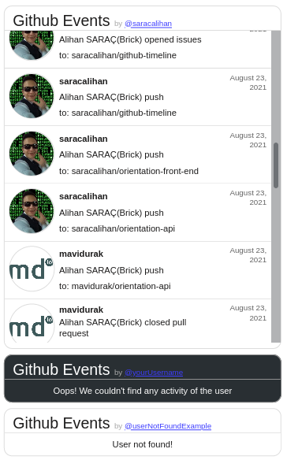

# GitHub Timeline V1.0.1
Its simple use embeded GitHub timeline.Its work with api.github.

## Introduce
+ [Roadmap](#roadmap)
+ [Usage](#usage)
  + [Example](#example-code-and-screen-shot) 
+ [Contributing](#contributing)
+ [License](#license)

## Roadmap
You can see what we've done before and what we will work on in the future;

- [x] Basic styling
- [x] Multiple timeline in same file
- [x] Responsive styling(auto detected screen size and restyling)
- [ ] Event(start, push, commit, review etc.) icon
- [ ] Detailed event info
- [ ] Multiple language
- [ ] Light/Dark theme
- [ ] Fix size(small, medium, large) attribute
- [ ] Auto component generator and previewer web site
- [ ] Customizable colors

`// TODO`

## Usage
**1**: Past the `div` on your HTML code then change the username from `data-username`
```html
<div class="github-timeline" data-username="write-here-username"></div>
```

**2**: Add the external script in your body
```html
<script src="https://cdn.jsdelivr.net/gh/saracalihan/github-timeline/scripts.min.js"></script>
```

Now its ready to work :)

### Example code and screen shot
```html
<!DOCTYPE html>
<html lang="en">
    <head>
    <meta charset="UTF-8">
    <meta http-equiv="X-UA-Compatible" content="IE=edge">
    <meta name="viewport" content="width=device-width, initial-scale=1.0">
    <title>Github Timeline</title>
    <style>
        body {
        display: flex;
        flex-direction: column;
        background-color: rgb(46, 46, 46);
        }

        .examples{
        margin: auto;
        }

        .examples > div {
        margin: 10px;
        }

    </style>
    </head>

    <body>

    <div class="examples">

        <!-- Usage copy the div what has class "github-timeline" then  -->
        <div class="github-timeline" data-username="saracalihan"></div>
        <div class="github-timeline" data-username="yourUsername"></div>
        <div class="github-timeline" data-username="userNotFoundExample"></div>
    </div>


    <script src="https://cdn.jsdelivr.net/gh/saracalihan/github-timeline/scripts.min.js"></script>
    </body>

</html>
```


## Contributing
`// TODO`
## License
[GNU GENERAL PUBLIC LICENSE Version 3](LICENSE)
